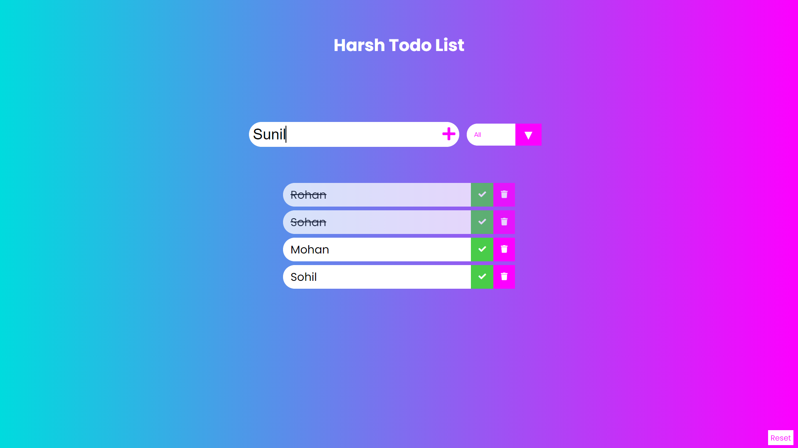

# TODO list 
## This JS Application is not Responsive and compatible over the ScreenSize greater then 450px
### This JS application is developed using:
* Vanilla JS
* HTML
* SCSS


## Functionalities
#### This Application First Takes input the name of the user. If you haven't been joined up.


#### If you have entered into it from before it will take up your name and then show your todo list if generated before.



> #### We can add Name/Items/Articles/Object Names in the Input Feild and then either by ```Enter``` or by ```+``` symbol right next to the InputFeild add the name to Todo List

> #### It has a Filtering Feature too.

> #### It can distinguish between __```Uncompleted```__ and __```Completed```__ items. 

#### And to reset the names and items and load back to the previous page click the reset button at the _**bottom-right**_ corner.

